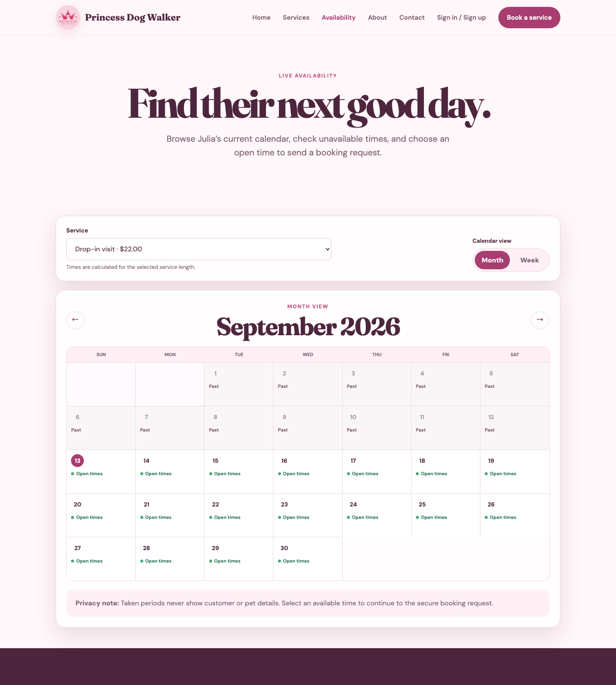
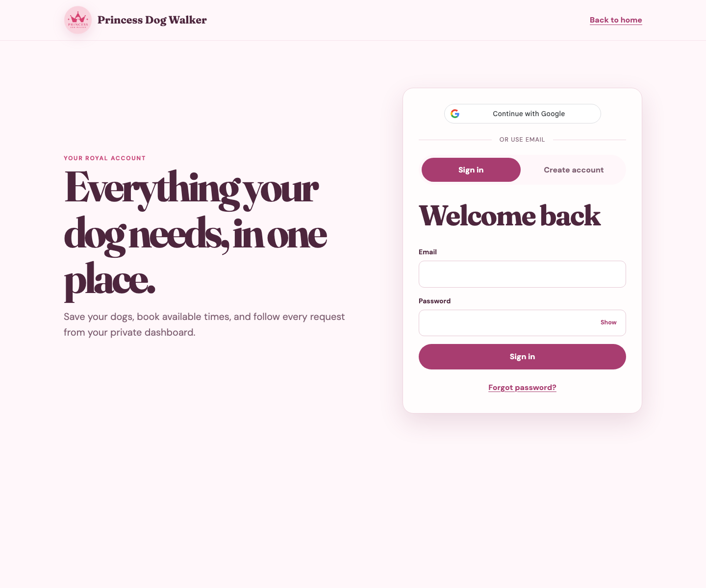
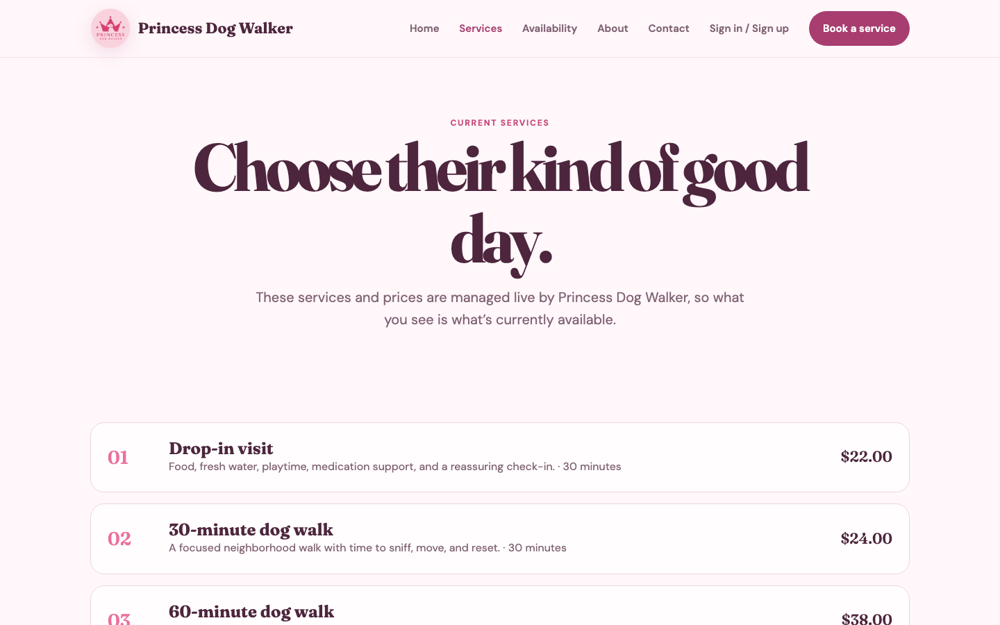

# Princess Dog Walker

Princess Dog Walker is a full-stack booking and business-management application I created for my friend Julia. She already provides dog walking and pet-care services and asked me for help expanding her small business. Until now, growing meant handling more questions, availability checks, and booking details through individual conversations. I wanted to give her a professional online presence and a system that could take care of that repetitive work while keeping the personal service her customers value.

Visitors can learn about Julia's services, see current prices, and check real availability before creating an account. Customers can save their dogs, request regular or overnight care, avoid unavailable times, and follow each request from their dashboard. Julia has a protected owner dashboard where she can manage services, customers, bookings, schedule blocks, and booking statuses without editing the website herself.

This project was also an opportunity to solve a real scheduling problem rather than build only a visual demo. Availability is calculated from service duration, existing bookings, owner-created blocks, and special overnight care windows. The API performs the final validation so two customers cannot book the same time, even if they both opened the booking page before the slot was taken.

The application is still in active development. I plan to add new features and improve existing ones as Julia uses the system, with the goal of making it even more convenient for her to manage and grow her business.

**Live site:** [princess-dog-walker.onrender.com](https://princess-dog-walker.onrender.com)

## Feature highlights

### Service-aware availability calendar



The public calendar is driven by live API data rather than a static schedule. A visitor first chooses a service because its duration determines which start times can fit. The calendar then:

- marks dates that still have bookable times in **Month** view;
- summarizes occupied periods across seven days in **Week** view;
- opens a detailed daily timeline when a date is selected; and
- carries the chosen service, date, and time into the booking form.

Pending and confirmed bookings and owner-created blocks are removed from the available slots. The public view shows only availability—not customer or dog details. Overnight care has a separate check-in/checkout flow that validates the care windows across the entire stay.

### Customer accounts and secure booking



Customers can create an account with email or Google, save multiple dogs, request an available appointment, and track every booking from a private dashboard. The browser provides a friendly review step, while the API re-checks dog ownership, service price and duration, owner blocks, and booking conflicts before it saves the request.

### API-managed services



The public catalog loads active services and prices from the API. From the protected owner dashboard, Julia can create, edit, disable, or remove eligible services without changing the frontend code. The same dashboard includes a color-coded booking calendar, status updates, customer-assisted booking, availability blocks, and nightly overnight totals.

## How booking works

1. A visitor checks services and availability without signing in.
2. A customer creates an account, saves one or more dogs, and chooses a service, date, and available time. Overnight stays use check-in and checkout dates instead.
3. The browser presents a final review, but the API independently validates the service, dog ownership, price, duration, blocks, and booking conflicts before saving anything.
4. Customer requests begin as **Pending**. Julia can confirm, decline, complete, or cancel them from the owner dashboard, and the customer sees the current status in their dashboard.

The owner dashboard also provides a color-coded booking calendar, customer-assisted booking, availability blocks, service management, customer approvals, and team publishing. All owner operations are protected by server-side role authorization.

## Built with

| Layer | Technology |
|---|---|
| Frontend | Semantic HTML, responsive CSS, and vanilla JavaScript |
| API | ASP.NET Core 10 Web API |
| Authentication | ASP.NET Core Identity, JWT role authorization, and Google Identity Services |
| Data | PostgreSQL 17 and Entity Framework Core migrations |
| Email | MailKit/SMTP for customer welcome messages |
| Delivery | Docker, Nginx, Docker Compose, and a Render Blueprint |
| Tests | xUnit with EF Core's in-memory provider |

## Project structure

The repository keeps the browser client, API, and automated tests separate, while the solution and deployment files at the root tie them together:

```text
frontend/
  *.html             Public, authentication, customer, and owner pages
  css/styles.css     Shared responsive design system
  js/                API client and page-specific behavior
backend/PawsAndPaths.Api/
  Controllers/       HTTP endpoints and authorization boundaries
  Models/ + DTOs/    Database entities and validated API contracts
  Services/          Booking, availability, email, auth, and seeding logic
  Data/Migrations/   EF Core context and PostgreSQL schema history
tests/                API and business-rule tests
docker-compose.yml    Local frontend, API, and PostgreSQL environment
render.yaml           Production deployment blueprint
```

## Start with Docker

1. Copy `.env.example` to `.env`.
2. Replace every placeholder. `JWT_KEY` should be a long random value; `OWNER_EMAIL` and `OWNER_PASSWORD` become the only owner account.
3. Run:

   ```bash
   docker compose up --build
   ```

4. Open `http://localhost:5500`.
5. Sign in with `OWNER_EMAIL` to reach the owner dashboard. New public registrations always receive the Customer role.

To enable the Google button locally, create a Google OAuth web client and set `GOOGLE_CLIENT_ID`. Add `http://localhost:5500` as an authorized JavaScript origin.

The API waits for PostgreSQL, applies migrations, creates the Customer and Owner roles, and seeds the configured owner account. The frontend runs on port 5500 and the API on port 5095.

## Run manually

Set configuration in the terminal rather than source code:

```bash
export ConnectionStrings__DefaultConnection='Host=localhost;Port=5432;Database=princessdogwalker;Username=postgres;Password=your-password'
export Jwt__Key='a-long-random-secret-at-least-32-characters'
export Owner__Email='owner@example.com'
export Owner__Password='your-strong-owner-password'
export Google__ClientId='your-google-web-client-id.apps.googleusercontent.com'
```

Then run:

```bash
dotnet tool restore
dotnet restore
dotnet tool run dotnet-ef database update --project backend/PawsAndPaths.Api
dotnet run --project backend/PawsAndPaths.Api
```

In another terminal:

```bash
python3 -m http.server 5500 --directory frontend
```

## Accounts and permissions

- Public visitors can browse Home, Services, Availability, About, and Contact.
- Customers can register, sign in, request/reset a password, edit their profile, manage multiple dogs, book open slots, view history, and cancel eligible bookings.
- Customers can also sign up or sign in with a verified Gmail or Google Workspace account when `Google__ClientId` is configured.
- The Owner role can view all customers and bookings, change booking statuses, and create/edit/disable/delete services and availability rules.
- Role decisions are made by ASP.NET authorization policies, never trusted from frontend state.
- JWTs are kept in browser session storage, so closing the tab ends the browser session.
- Development can expose a password-reset token for local testing. Production keeps tokens private; connect an email provider before launch.

## Availability and booking conflicts

Julia is available every day by default. Owner-created availability records are exceptions that block an entire date or a time range, and Julia can edit or remove them from the owner dashboard.

The API calculates the booking end time from the selected database service. It rejects requests when the service is inactive, the dog belongs to another account, the time falls outside availability, a block overlaps it, or another Pending/Confirmed booking overlaps it. Creation uses a serializable PostgreSQL transaction plus an indexed date/start/end range to prevent concurrent double-booking attempts.

Overnight stays are stored as one multi-day booking. By default, they reserve care from 10:00 PM to 9:00 AM plus a 2:00–3:00 PM visit on full middle days. Only those care windows block other appointments, and Julia can customize the schedule for an individual stay.

## Key endpoints

| Area | Endpoints |
|---|---|
| Authentication | `POST /api/auth/register`, `/login`, `/forgot-password`, `/reset-password` |
| Google authentication | `GET /api/auth/google-config`, `POST /api/auth/google` |
| Profile | `GET/PUT /api/users/me`, `GET /api/users/customers` (Owner) |
| Dogs | `GET/POST /api/dogs`, `GET/PUT/DELETE /api/dogs/{id}` |
| Services | `GET /api/services`, Owner `POST`, `PUT /{id}`, `DELETE /{id}` |
| Availability | `GET /api/availability/slots`, Owner rule `GET/POST/PUT/DELETE` |
| Bookings | Customer `GET/POST`, cancel; Owner list and status update |
| Contact | `POST /api/contact` |

## Database relationships

- `AppUser` has many `Dogs` and many `Bookings`.
- `Dog` belongs to one user and has many bookings.
- `ServiceOffering` has many bookings; booking price is snapshotted so later price edits do not change history.
- `Booking` belongs to a user, dog, and service and stores date, start/end, instructions, status, and creation time.
- `AvailabilityRule` stores recurring weekday or specific-date available/blocked ranges.
- Identity tables store password hashes, roles, reset tokens, lockout data, and security stamps.

The `PrincessDogWalkerAccounts` migration replaces the earlier appointment-request prototype tables with the account-based schema. Back up any real prototype data before applying it because those old tables are removed.

## Testing

```bash
dotnet test
```

Tests verify that booking duration and price come from the database service and that overlapping active bookings are rejected.

## Before production

- Connect an email provider for password reset delivery and contact notifications.
- Use HTTPS and a production secret manager for database, JWT, and owner credentials.
- Set absolute production Open Graph image URLs.
- Add audit logging, backup policy, rate limiting, and optional email verification.

## Public deployment

I chose **Render** because this project needs more than static website hosting: it has an ASP.NET Core API, a PostgreSQL database, environment secrets, migrations, and a browser frontend. Render can deploy the Dockerized API, provide a managed PostgreSQL database, and serve the frontend and API from the same public domain. Connecting the GitHub repository also enables automatic deployments when the project is updated, which makes maintaining a live application for a small business much simpler.

The infrastructure is described in `render.yaml`, so the production web service, database connection, health check, and required environment variables are versioned with the project instead of being configured only through a dashboard. Sensitive values such as the JWT signing key, owner credentials, and email password remain in Render's environment settings rather than in the repository.

To deploy it, connect this repository as a Render Blueprint and provide the prompted owner email, owner password, and Google client ID. The API serves the frontend from the same public domain and applies EF Core migrations at startup. Then add the final `https://<site>.onrender.com` address to the Google OAuth client's authorized JavaScript origins.

### Welcome email configuration

New email/password and Google-created customer accounts receive one welcome email when SMTP is configured. For Julia's Gmail account, enable Google 2-Step Verification, create a dedicated app password, and configure these Render environment variables:

```text
Email__SmtpHost=smtp.gmail.com
Email__SmtpPort=587
Email__SmtpUsername=kadulinaiulia@gmail.com
Email__SmtpPassword=<Google app password>
Email__FromAddress=kadulinaiulia@gmail.com
Email__FromName=Princess Dog Walker
```

Store the app password only in Render's environment settings. Never add it to this repository. Registration remains available if the mail server is temporarily unavailable; the failure is recorded in application logs.
